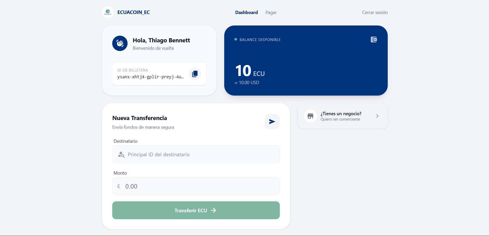
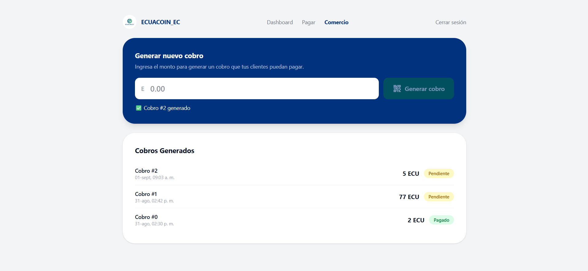
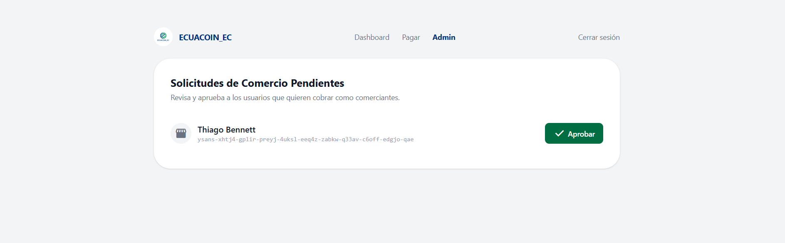

## EcuaCoin - Criptomoneda desarrollada en Motoko

Una criptomoneda diseñada para que las microempresas del sector comercial acepten pagos digitales — construida sobre Internet Computer (ICP).

## ✨ ¿Qué hace?

ECUACOIN_EC no es solo una transferencia de tokens — es un sistema completo de pagos pensado para el día a día de un negocio pequeño:

🔐 Autenticación descentralizada con Internet Identity (sin contraseñas, sin bases de datos de usuarios centralizadas)

💸 Transferencias entre usuarios en tiempo real, on-chain

🏪 Sistema de roles: cualquier usuario puede solicitar convertirse en comerciante, sujeto a aprobación de un administrador

🧾 Generación de cobros: los comerciantes aprobados crean solicitudes de pago con un monto específico — el equivalente digital de "son $5, por favor"

✅ Panel de administración: aprobación de comerciantes con una vista clara de solicitudes pendientes

📊 Tokenomics básicas: suministro máximo, minteo controlado, y quema de tokens

## 🛠️ Stack técnico

Blockchain	Internet Computer Protocol (ICP)

Backend / Smart Contracts	Motoko

Frontend	SvelteKit + Vite

Estilos	Tailwind CSS v4

Autenticación	Internet Identity (@dfinity/auth-client)

## 🚀 Por qué este proyecto

La mayoría de proyectos de cripto en portafolios se quedan en "transferir tokens de A a B". Este va un paso más allá: modela un caso de uso financiero real — cómo una tienda de barrio podría aceptar pagos digitales sin depender de intermediarios bancarios tradicionales, con un flujo de verificación de comerciantes inspirado en cómo operan pasarelas de pago reales (Mercado Pago, PayPal Business).

## 📸 Capturas

### Dashboard principal

### Solicitud de comerciante

### Panel de admin

